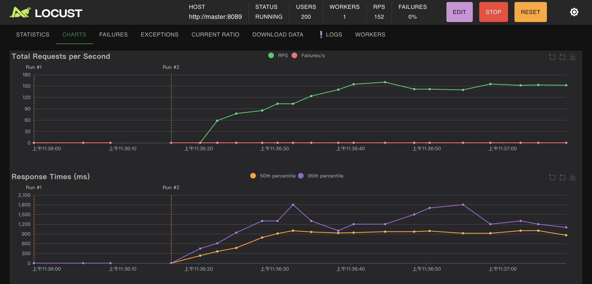

# locust

## 簡介
這個專案使用 Locust 進行 socket.io 負載測試。它包含一個自定義的 Locust 使用者類別 `SocketIOUser`，以及一個具體的測試類別 `SocketIOHealthCheckUser`。


## 安裝
請確保已經安裝了以下依賴：
- locust
- python-socketio

你可以使用以下命令安裝這些依賴：
```bash
pip install locust python-socketio
```

## 使用方法
1. 編輯 `locustfile.py` 以配置你的測試參數。
2. 在命令行中運行 Locust：
```bash
locust -f /workspaces/locust/locustfile.py
```
3. 打開瀏覽器並訪問 `http://localhost:8089`，配置並啟動你的測試。

## 文件結構
- `locustfile.py`: 包含 Locust 測試邏輯的主要文件。
- `README.md`: 本說明文件。

## 測試類別
### SocketIOUser
這是一個抽象類別，包含了 WebSocket 連接和斷開的邏輯。

### SocketIOHealthCheckUser
這是一個具體的測試類別，繼承自 `SocketIOUser`，並實現了一個 `health_check` 任務，用於發送和驗證 `health-check` 事件。

## 事件監聽器
在 `locustfile.py` 中，我們還定義了一個事件監聽器，用於在 Locust 初始化時記錄信息。